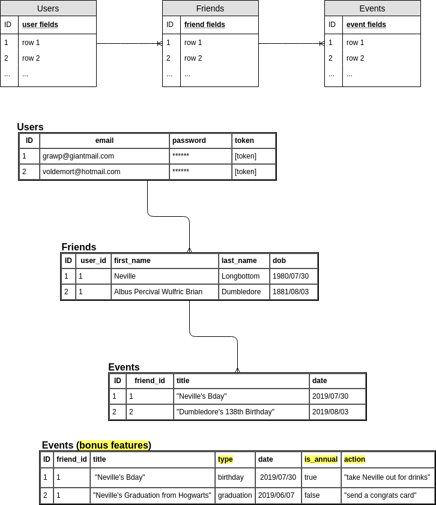
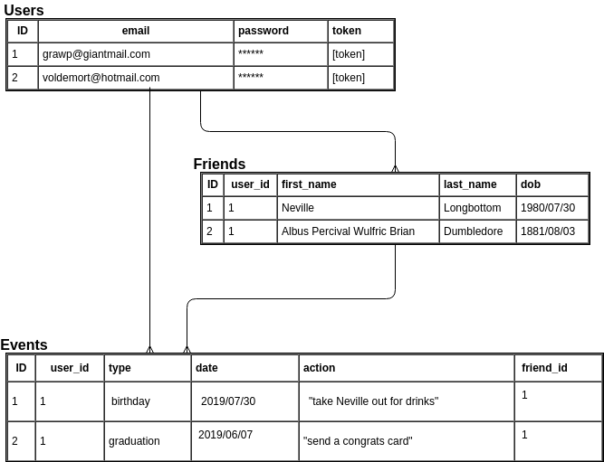
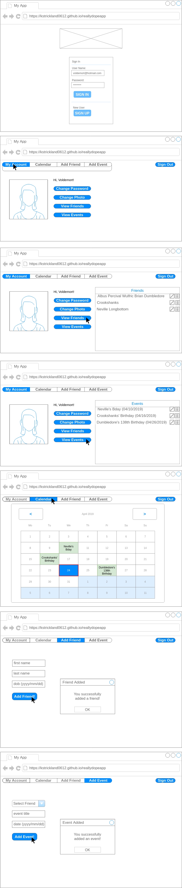

# K Strickland's Evento App

Hello! Welcome to Evento. This app makes sure you never have to send a belated card, gift, or text ever again. It keeps track of your friends' birthdays and more, and tells you about the day's events each time you log on.

Evento is a full-stack app I built during my time at General Asssembly's Software Engineering Immersive. This was my first time building a database from scratch, and I really enjoyed diving into the back-end with Rails.

On the front-end, it was fun to think of the optimal user experience and work towards that with each new feature. By placing the user at the center of the project, I was able to think of some useful features to build that allowed me to flex a couple programming muscles I didn't know I had.

One of the best parts of this project is how much it stretched me to find answers on my own, and in the process really solidify concepts that I've been a bit unsure of.

I feel great about what I learned through this project.

Enjoy!

-K

## Technologies Used

* HTML5
* CSS3
* Bootstrap
* JavaScript
* jQuery
* Handlebars
* Ajax
* Ruby
* Rails
* Heroku
* fullcalendar.io
* moment.js

## Planning

My first step in planning this app was to determine MVP based on the requirements provided to me.

I set up a general schedule for myself with MVP features slated for the first two days of the project. I then added some scheduled time for debugging, layout, and extra features for the final two days.

As I worked through the project I identified extra features to work on, and because I hit MVP early in the project process I was able to prioritize working through the extra features I was most excited about.

## Challenges/Victories

- **Database structure**

My original plan for this project was to have a user resource, which had a one to many relationship with a friends resource (one user, many friends). I also wanted to create an events resource in a one to many relationship with friends (one friend, many events). With this being my first time building a back-end, I did not completely understand how user_id and references should work when you are dealing with owned resources.

Once I realized that I needed to add a user_id foreign key to my friend and users tables, the database change was very straightforward.

I also determined that my controllers needed to inherit from the ProtectedController, and was able to work through that configuration once I knew the end goal.

- **Populating a select dropdown with data from database**

My database is set up so that a friend has many events. If you want to create an event, you must tie it to a specific friend that you've already created. I didn't want the user to have to know the friend_id in order to create an event, so I built a solution with a select option list, handlebars, and a hidden input field. I created some methods to capture that friend_id without the user even knowing it. All they have to do is select from a dropdown list the friend they want to create the event under, and done!

- **Handlebars helpers**

These little things are so useful! I created a dateCompare helper that can tell me if an event is today, and from there display an appropriate message to my user. I also created a helper to format the dates in my app using moment.js to look like: Wednesday, September 2nd 2020.

- **Calendar view**

I made a stretch goal to display all events in calendar format for the user. I used fullcalendar.io to accomplish this. I did run into some bugs because of the fact that I was reading from old docs and certain features I was tryingt o use have been since depricated. I learned the importance of making sure you're in the right doc version :)

I'm proud of my updateCalendar function, which uses store as well as a .render() and .destroy() method to display an up-to-date calendar populated with all the user's events on the click of a button.

### ERD

My Entity Relationship Diagram changed a bit based on what I learned about rails and how SQL databases work.

My first ERD had a one to many relationship of users to friends, and another one to many relationship of friends to event.

I found that I actually needed a one to many relationships of users to friends and also of users to events, while keeping the one to many relationship of friends to events.

- **My V1 ERD:**

- **My final version ERD** (notice all the bonus features from v1 are incorporated now):

### Wireframes

As always, I put together some wireframes to help me keep the end goal in mind. I found myself referring back to my wireframes on a daily basis. It does really help avoid scope screep.

### User Stories

#### Main Features:
1. As a user, I want to create and save a friend with a first name, a last name, and a date of birth.
2. As a user, for each friend I want to be able to create and save events with an event category and an event date.
3. As a user, I want to see a notification when I successfully create a friend and/or an event.
4. As a user, I want to see a list of my friends and a list of all events with dates.
5. As a user, I want to see today’s events when I log in.

#### Authorization Features:
6. As a user, I want to sign up for an account or sign into an existing account using my email and password before I access the app so that my app data can be saved to my account.
7. As a logged in user, I want to click on a change password button and have the ability to change my password for my account so that I can edit my password if needed.
8. As a logged in user, I want to click a sign out button so that I can sign out of my account.
9. As a user, I want to receive a notification on sign up success and failure, sign in success and failure, change password success and failure, and sign out success and failure.

#### Extra Features:
10. As a user, I want to be automatically signed in once I sign up so that I don't have to complete the sign in form when I've just signed up.
11. As a user, I want to be able to add an action (optional text field) to events so I can keep track of what I want to do for my friend on their special day.
12. (after US11) As a user, I want to be able to view my past actions for friends’ events so that I have a record of what a good friend I am.
13. As a user, I want to filter what upcoming events I see by week, month, and year.
14. As a user, I want to see my events displayed in a calendar format.
15. As a user, I want to receive an email reminder on the day of each event.
16. (after US16) As a user, I want to customize the frequency of event email reminders.
17. As a user, I want my friends' upcoming birthdays to be automatically created as events based on their date of birth so that I don't have to manually add each birthday each year.

## Future Thinking
The extra features user stories above lay out the things I'm most interested in adding to this app moving forward.

I was able to complete user story 11 to store event actions (like gift ideas) on each event.

I was also able to complete user story 14 by rendering a calendar in my app using fullcalendar.io. I built the functionality to add all the user's events to the calendar.

## Wanna try it?

### [You can use Evento here!](https://kstrickland0612.github.io/evento-client/)

### [The deployed Heroku database lives here](https://sheltered-cliffs-69470.herokuapp.com/)

### [Take a look at my back-end repo here](https://github.com/kstrickland0612/evento-api)
